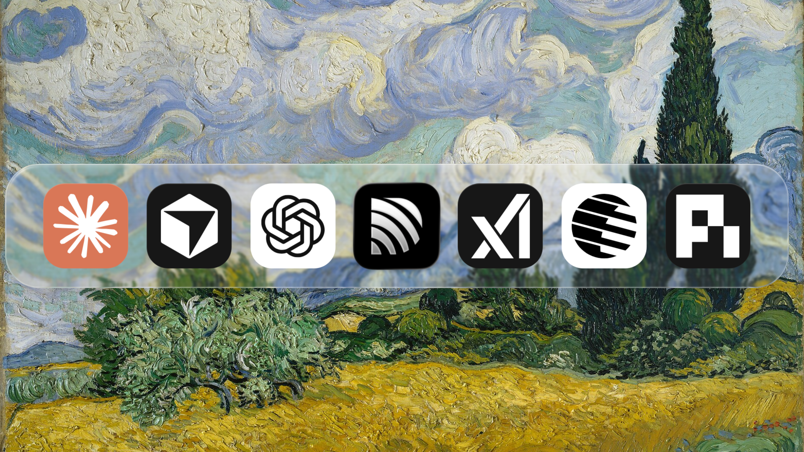

# Ducoro Motion Studio



**The source behind our 21-second product film. Clone it, see how it works, and make your own.**

Oil paintings, a curved glass dock, rotating agent icons, a smooth camera push, classical piano, and a final mouse click. Built with React and Remotion. The complete animation, assets, timing, and rendering scripts are here.

[Watch the film](exports/ducoro-agent-group-v1-en.mp4) · [Try Ducoro](https://ducoro.ai/download/) · [中文说明](README.zh-CN.md)

This film introduces [Ducoro](https://ducoro.ai): **Group your Bots in Ducoro. Keep your things moving and get your attention back.** If you came for the animation, take the source and remix it. If you work with Bots, try Ducoro and tell us what you think.

## Quick start

Install [Bun](https://bun.sh), then:

```sh
git clone https://github.com/ducoro/motion-studio.git
cd motion-studio
bun install --frozen-lockfile
bun run studio
```

Open **http://localhost:3142/DucoroAgentGroup**. Press play, or scrub the timeline to inspect any frame. The shipped assets are ready to use; previewing requires no API keys or access to Ducoro’s main repository.

The default preview port is 3142. To use another port, run:

```sh
bunx remotion studio src/register.ts --public-dir=assets --port=3143
```

## Render your video

Install FFmpeg (including `ffprobe`). On macOS:

```sh
brew install ffmpeg
```

Then:

```sh
bun run typecheck
bun run test
bun run stills
bun run render
bun run verify
```

The first render downloads Remotion’s Chrome Headless Shell and needs internet access. Subsequent rendering uses the local browser and bundled media.

- **Video:** `exports/ducoro-agent-group-v1-en.mp4`
- **Review frames:** `review/`
- **Format:** 1920 × 1080, 30 fps, 626 frames (20.867 seconds), H.264 + AAC

`verify` checks the tests, frame count, codecs, duration, reading pauses, review images, asset checksums, and exact AAC packet reuse. Rendering keeps the soundtrack at its original speed.

## Make it yours

| Change | Where |
| --- | --- |
| Product icon | `sources/brands/ducoro-app-icon.png` |
| Closing copy, scene timing, and icon rotation | `src/film.ts` |
| Icon colors | `src/brands.ts` |
| Agent SVG inputs | `sources/brands/` |
| Oil paintings and their source records | `assets/backgrounds/` |
| Background cuts and crossfade duration | `src/backgrounds.ts` |
| Dock size and spacing | `src/dock-layout.ts` |
| Camera movement | `src/camera-motion.ts` |
| Glass curvature, thickness, and refraction | `src/glass/optics.ts` |
| Soundtrack and source record | `assets/music/` |
| Click sound synthesis | `scripts/prepare-click.ts` |
| Scene composition and closing animation | `src/AgentGroupFilm.tsx` |

To replace the product icon, use a square PNG with transparent padding matching the bundled icon. To replace a painting, keep its existing filename for a simple swap; update `sources.json` when adding or removing images. The camera is designed for the bundled 16:9 composition, so changing the resolution also requires adjusting the layout.

After editing the brand inputs, glass settings, soundtrack, or click timing:

```sh
bun run assets:prepare
bun run typecheck
bun run test
bun run stills
bun run render
bun run verify
```

`assets:prepare` rebuilds the brand SVGs, product icon, glass maps, and music/click mix, then refreshes production checksums. For direct changes to painting files, run `bun run checksums` after updating the corresponding source records. When you add a new asset, also add its path to `provenance.json` before refreshing checksums. `checksums` records the files you intentionally prepared; `verify` checks them against that record.

Replace the brand inputs or palette rather than editing the generated SVGs if you plan to rebuild assets.

## How the effect works

**One timeline.** Remotion evaluates each scene from its frame number. Studio preview and rendered frames use the same composition, camera, captions, and audio.

**A stable dock.** The row has fixed dimensions. Its entire container scales as one object, so changing icons does not change its width or make the camera jitter.

**Curved glass.** A rounded-rectangle distance field describes the lens. Surface normals and Snell refraction generate a displacement map. An SVG filter samples the background through that map, with a small blur and edge highlights. Icons stay in a separate foreground layer. This is an original browser approximation informed by [Apple’s Liquid Glass presentation](https://developer.apple.com/videos/play/wwdc2025/219/), [kube.io’s optical explanation](https://kube.io/blog/liquid-glass-css-svg/), and the [SVG displacement standard](https://www.w3.org/TR/filter-effects-1/#feDisplacementMapElement).

**Continuous background coverage.** All 14 paintings stay mounted. Each cut keeps the old image underneath while the new image fades in over three frames (100 ms), preventing a white gap.

**Readable ending.** Caption beats include an extra 300 ms of reading time. The final icon press and synthetic mouse click share the same starting frame. The mix is rendered once and its AAC packets are copied directly into the video.

## Project map

```text
src/                 React scenes, timeline, camera, glass, and tests
sources/brands/      Self-contained brand generation inputs
assets/              Ready-to-use media, glass maps, and source records
scripts/             Asset preparation, rendering, and verification
review/              Key frames from the shipped film
exports/             The rendered demo video
docs/banner.png      Opening frame shown above
provenance.json      Snapshot origin, asset sources, and checksums
```

This is an independent production snapshot. It runs and evolves in this repository.

## Sources and reuse

Ducoro-authored animation and tooling code is available under [MIT](LICENSE). Paintings and the piano recording have their own CC0 source records. Brand graphics retain their owners’ rights and trademark status; use your own branding when making another product’s film. Dependencies, including Remotion, retain their own terms. See [asset notes](ASSETS.md), [third-party notices](THIRD_PARTY_NOTICES.md), and [Remotion’s license documentation](https://www.remotion.dev/docs/license).

The motion study was inspired by [Nathan Baschez’s Notion film](https://x.com/nbaschez/status/2105815862460723434). The derived geometry needed by this animation is included. The optional measurement script reads an independently supplied reference video at `.local/reference/reference.mp4`; the original reference video and audio are local study material, excluded from the distributed source. See [reference measurement](docs/reference-measurement.md).

## Meet Ducoro

You have seen the film. [Try the product](https://ducoro.ai/download/) behind it: bring your Bots together and let your things keep moving.

[Download](https://ducoro.ai/download/) · [Current trial and pricing](https://ducoro.ai/pricing/) · [Ducoro on GitHub](https://github.com/ducoro)
